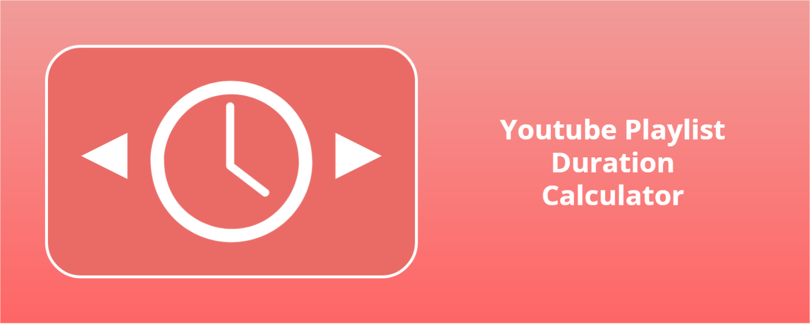
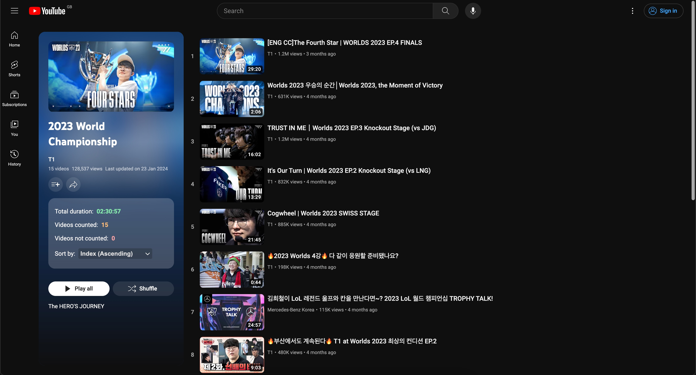
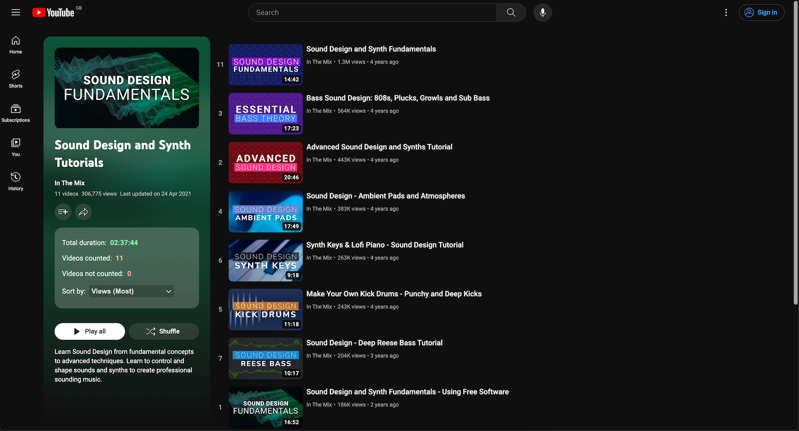
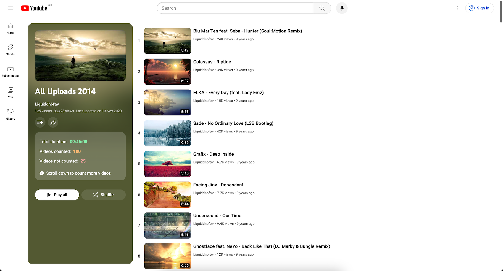

# YouTube Playlist Duration Calculator

A web extension for Chrome & Firefox that calculates & displays the total
duration of a YouTube playlist.



## Previews

<p align="center">
  
</p>

<p align="center">
  
  
</p>

## Get the extension

The extension is available for download at:

- Chrome: [Web Store](https://chrome.google.com/webstore/detail/youtube-playlist-duration/pijbakhgmhhadeakaocjfockpndcpobk)
- Firefox: [Firefox Add-ons](https://addons.mozilla.org/firefox/addon/youtube-playlist-duration-calc/)

## Features

- Calculate & display the total duration of a YouTube playlist
- Sort playlists with 100 videos or less, by the following criteria:
  - Duration
  - Channel Name
  - Index
  - Views (only for some locales)
  - Upload Date (only for public playlists & some locales)
- Translations for several locales (en, es, pt, zh)

> **Note:** The sorting feature is only enabled for playlists containing 100
> videos or less. This is because for larger playlists (>100 videos), YouTube
> only loads the next 100 videos after you scroll to the bottom of the page.
> This can often produce inconsistent & inaccurate sorting results, so it has
> been disabled for now.

## Getting Started

This section will explain how to get the project setup locally for development.

### Dependencies

To work with this project, you will need the following dependencies:

- Node.js v20+
  - https://nodejs.org/en/download
  - https://github.com/Schniz/fnm
  - https://github.com/nvm-sh/nvm

### Get the Source

This project is hosted at:
https://github.com/nrednav/youtube-playlist-duration-calculator

You can clone the project locally via:

HTTPS:

```
git clone https://github.com/nrednav/youtube-playlist-duration-calculator.git
```

SSH:

```
git clone git@github.com:nrednav/youtube-playlist-duration-calculator.git
```

### Installation

To install the project's dependencies:

```
cd youtube-playlist-duration-calculator/
npm install
```

### Building

Build the extension for a specific browser using:

```
npm run build:chrome
npm run build:firefox
```

This will output the extension files into a sub-directory named `dist` within
the `youtube-playlist-duration-calculator` directory.

### Run

#### Automatic

Run the project in development mode with:

```
npm run dev
```

This will do the following:

- Determine the browser via the environment variable `VITE_TARGET_BROWSER`
  - It will default to Chrome if the variable is undefined
- Build the extension for the selected browser
- Open the selected browser
- Automatically & temporarily load the extension in the opened browser
- Open a test YouTube
  [playlist](https://www.youtube.com/playlist?list=PLAhTBeRe8IhMmRve_rSfAgL_dtEXkKh8Z)
  overview page

#### Manual

To install & run the extension manually, follow these steps:

Firefox:

- Build the extension with `npm run build:firefox`
- Install the `web-ext` tool from Mozilla
  - Link: https://extensionworkshop.com/documentation/develop/getting-started-with-web-ext/
- Test the extension by running `web-ext run` from within `dist/` directory
  - Visit any YouTube playlist overview page and verify the extension
    calculates & displays the playlist duration
- Sign the extension with `web-ext sign`
  - Follow the instructions on the same page linked above
  - You will need to run this command within the `dist` directory too
  - At the end, you should have a `.xpi` file generated within a sub-directory
    named `web-ext-artifacts`
- In your Firefox browser
  - Navigate to `about:addons` via the address bar
  - Click the cogwheel button located at the top-right of the page
  - From the dropdown, select `Install Add-on From File`
  - Locate & select the `.xpi` file generated in a previous step
  - The extension should now be installed

Chrome:

- Build the extension with `npm run build:chrome`
- In your Chrome browser
  - Navigate to `chrome://extensions` via the address bar
  - Select the checkbox next to `Developer Mode`
  - Click the button named `Load Unpacked Extension`
  - Locate & select the `dist` sub-directory within the
    `youtube-playlist-duration-calculator` directory
  - The extension should now be installed

To verify the extension works, visit any YouTube playlist overview page & verify
that you see the duration calculated & displayed within the playlist information
panel located on the left-hand side of the page.

## Issues & Requests

If you wish to request a new feature or report a bug, please open an issue by
clicking
[here](https://github.com/nrednav/youtube-playlist-duration-calculator/issues/new).

## Translations

For a list of locales currently supported by the extension, please see
[public/\_locales](./public/_locales/)

Additional translations are most welcome! Please see
[docs/translations.md](./docs/translations.md) for more details.
