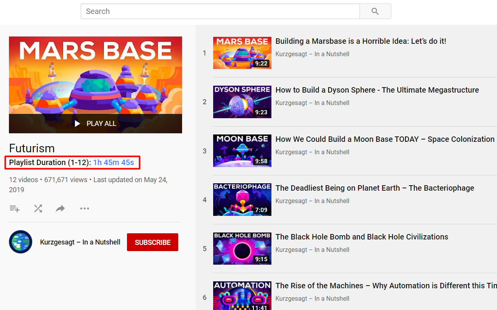

# Youtube Playlist Duration Calculator

A chrome web extension to calculate & display the total duration of a youtube playlist.

## Previews

  

  
  

## Installation

You can install the latest version of the extension from the Chrome Web Store (Pending Review).

Alternatively, you can install the extension manually using the following instructions:-

1. Download this project as a zip file.
2. Navigate to `chrome://extensions` in Google Chrome or a chromium-based fork such as Brave Browser.
3. Check the box for **Developer Mode**
4. Look for a button that says **Load unpacked extension** and click it
5. Select the project zip file you downloaded in Step 1.
6. You should now see the extension installed amongst your other extensions.
7. To verify that it works, navigate to a youtube playlist overview page, such as: https://www.youtube.com/playlist?list=PL5o3ll3G4acxgDMSO7JXvDsosQ-UDPL6n. You should see the playlist's total duration appear under the playlist title.